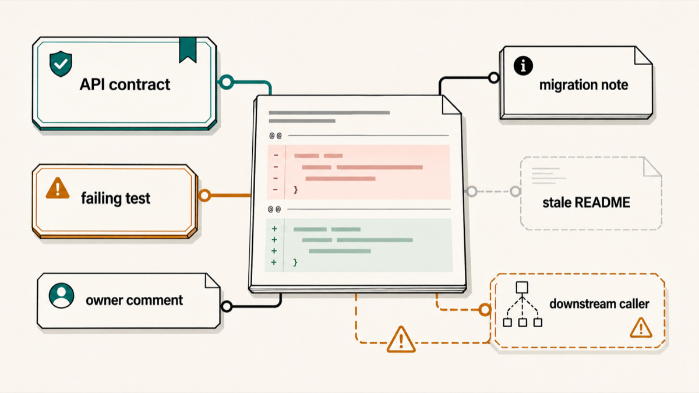
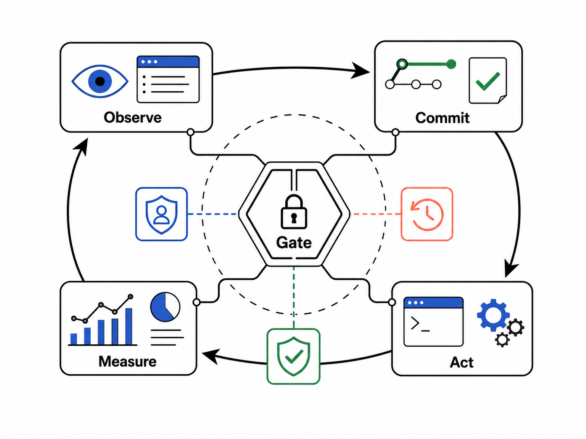

# Agent Harnesses Need Interpretation And Control

Most agent harnesses in 2026 are still described as wrappers around tools: give the model context, let it call commands, run tests, and ask it to recover when something fails. That frame is too thin. A serious coding-agent harness is closer to an institution. It decides what counts as evidence, which constraints have authority, when ambiguity is tolerable, and when an action is allowed to become irreversible.

Hermeneutics gives harness builders a vocabulary for interpretation. Cybernetics gives them a vocabulary for control. The useful overlap is not philosophical ornament. It changes the shape of the product.

## Three Hermeneutic Lessons

### 1. Retrieve obligations, not "relevant context"

The usual retrieval question is: which files are related to this task? The better question is: which promises can this diff break?

A function is not meaningful because it sits near other functions. It is meaningful because it carries obligations: public API behavior, CLI precedence rules, migration guarantees, compatibility fixtures, downstream caller assumptions, performance budgets, or acceptance criteria. A harness that retrieves only nearby code gives the agent text. A harness that retrieves endangered obligations gives the agent the constraints that make the text matter.

In a config refactor, for example, the agent should see not only `loadConfig.ts`, but also the v2 compatibility fixture, the CLI flag precedence test, the migration note that unknown keys must warn instead of throw, and the public setup docs. That is not "more context." It is veto-bearing context attached to the diff.

### 2. Authority is task-relative, not artifact-intrinsic

Repos are contested archives. Tests, docs, comments, CI config, generated files, stale issues, changelogs, and current implementation can disagree. The harness should not pretend all retrieved text has equal authority, and it should not hard-code a universal ranking like "tests beat docs."

Authority depends on the operation. In a bug fix, an existing failing test may govern. In a breaking v3 migration, that same test may be a target for deletion. In a public API change, docs and changelog commitments may outrank an implementation quirk. In a cleanup, old comments may be disposable.

The primitive is conflict-aware evidence ranking. When artifacts disagree, the harness should force the agent to name the conflict and state which artifact governs this task. Without that step, retrieval relevance quietly masquerades as authority.

### 3. Execution feedback should revise the task model

Many harnesses use a linear loop: understand, plan, edit, test, patch failure, repeat. That is not enough. Test failures, compiler errors, unexpected diffs, and logs often reveal that the agent misunderstood the task itself.

If the issue says "login times out," the agent may first edit request timeouts. If tests show that direct password login works and only refresh-token rotation fails, the harness should require a meaning update: this is not a timeout bug, it is a session invalidation race. The correct next action is to abandon the timeout patch and inspect token rotation.

The primitive is an interpretation checkpoint after surprising evidence. Ask: what did we believe, what did the repo show us, does the repair theory still hold, and should we continue, narrow, or restart?

## Three Cybernetic Lessons

### 1. Manage commitments, not hidden thoughts

It is tempting to say the harness controls the agent's belief state. That is too strong. The model's internal state is not directly observable. What the harness can control is the set of external commitments the agent must make before acting.

The useful primitive is a commitment ledger: suspected root cause, evidence, allowed edit surface, expected failing command, protected oracle, and reason for touching each file. Every material edit should attach to a claim the repo can contradict.

For a logout-on-refresh bug, the harness does not need to inspect the model's mind. It can require: "Claim: cookie maxAge is computed incorrectly. Evidence: failing browser test shows immediate expiry. Allowed files: `packages/auth-cookie/**`. Blocked files: `frontend/session.ts` until new evidence appears."

### 2. Give escalating authority, not raw tools

Tool access is actuator access. `rg`, `npm install`, `prettier --write .`, snapshot updates, database migrations, lockfile edits, and PR creation do not have the same blast radius. Treating them as a flat menu makes agents unstable.

The primitive is an authority ladder. Read-only probes come first. Scoped reversible edits come next. Repo-wide mutations require explicit evidence, a checkpoint, and a rollback path.

If a TypeScript error appears after a dependency bump, the first tools should be `git diff`, `npm ls`, targeted search, and the narrow failing test. `npm audit fix`, broad formatting, and lockfile mutation should require escalation. More tool power does not make the agent smarter; it lets uncertainty damage more surface area.

### 3. Preserve the measurement, not just green tests

Passing tests are not meaningful feedback if the agent weakened the instrument that detected the bug. A harness that rewards "red became green" invites test deletion, snapshot churn, mocks that erase the behavior, and flaky-path skips.

The primitive is a frozen defect channel. Before edits, capture the failing command, input, expected behavior, stack trace, seed, and protected oracle. During repair, implementation edits are allowed. Oracle changes go through a separate path labeled as a spec change, not a fix.

The harness question should not be "Did CI pass?" It should be: did this exact measured defect disappear while the measurement instrument stayed valid?

## The Shared Invariant

The deepest shared rule is: no committed action may proceed against an unretired live veto.

A live veto is a still-plausible interpretation under which the proposed action would be unacceptable. The harness does not need to resolve every ambiguity. It may act while ambiguity remains if the action is acceptable under every live reading. But if one live reading vetoes the action, the harness must either retire that reading with prior evidence or avoid commitment.

That turns agent harnessing from "infer intent, plan, execute" into "maintain interpretations, compute shared acceptable actions, commit only where no live veto remains."

That design shift is what people keep missing. The harness is not just a prompt router. It is a control system over commitments, authority, and measurement.

## Proof Notes

This post was produced as a harness proof exercise:

- Extended Pro hermeneutics conversation: `747b9ac0-af37-4c01-9cac-2cad1dbe25ca` then continuation `34b84a10-01fd-4d7c-939e-a4aae8f38e95`.
- Extended Pro cybernetics conversation: `d035fcce-4f99-42eb-8672-9ba3dac4e93f` then continuation `c168efbd-2ba5-4ded-9d48-e3807fa94376`.
- Standalone novel Extended Pro query: `4b3bd83f-d6d2-4f7b-92b5-4c67a05454aa`, nonce `AGENTIFY-NOVEL-PRO-20260513`.
- Image artifacts were generated through Agentify image generation and copied into `docs/images/`: hermeneutic image run `a052e04d-eb0a-4078-83bd-336ad9c78738`, cybernetic image run `d6cbeb58-1968-4f09-aad7-88aa9c8e04e8`.
